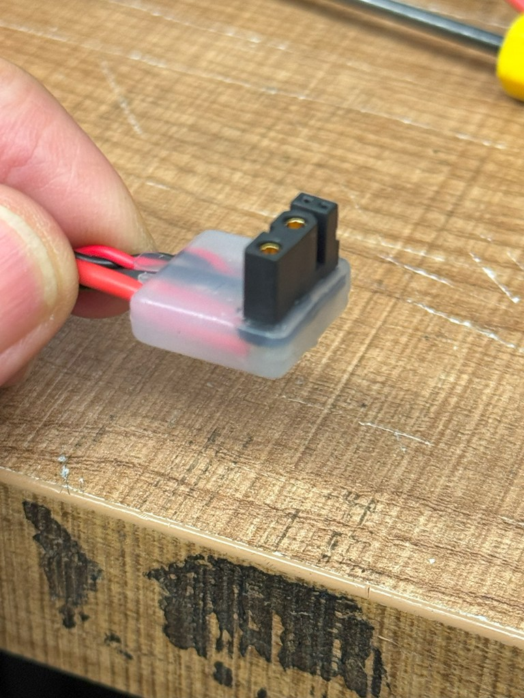

# ホットボンド成形によるL字コネクタ加工ガイド

このリポジトリは、汎用のコネクタをホットボンドと金型でL字加工する手順と、そのためのアルミ金型を低価格で外注する方法をまとめたものです。

## 🔧 目的

ロボットや電子回路のケーブル配線において、コネクタの向きをモータに沿わせたい場面は多々あります。  
本ガイドでは、誰でも簡単に、安価に、L字のコネクタ加工ができるようにノウハウを共有します。

---

## 📦 内容一覧

- `mold-design/` : アルミ金型の設計図（PDF・CAD）
- `jlccnc-order-guide.md` : JLCCNCで金型を発注する方法
- `connector-molding.md` : 実際のL字加工手順
- `parts-list.md` : 使用部材・工具一覧
- `images/` : 各工程の写真・完成例

---

## 🌎 金型発注先について

金型は中国のCNC加工サービス「JLCCNC（[https://jlccnc.com](https://jlccnc.com)）」を利用しました。  
アルミ製の簡易金型で、1個あたり約\$38。発注から6日で到着しました。

詳細な発注手順は [`jlccnc-order-guide.md`](jlccnc-order-guide.md) をご覧ください。

---

## ✋ 注意事項

- 本ガイドはDIY用途を想定しています。高電圧・高周波用途のコネクタには使用しないでください。
- 加熱器具やホットボンド使用時は火傷にご注意ください。

---

## 📄 ライセンス

このリポジトリの内容は [CC BY 4.0](https://creativecommons.org/licenses/by/4.0/deed.ja) に基づき公開しています。
