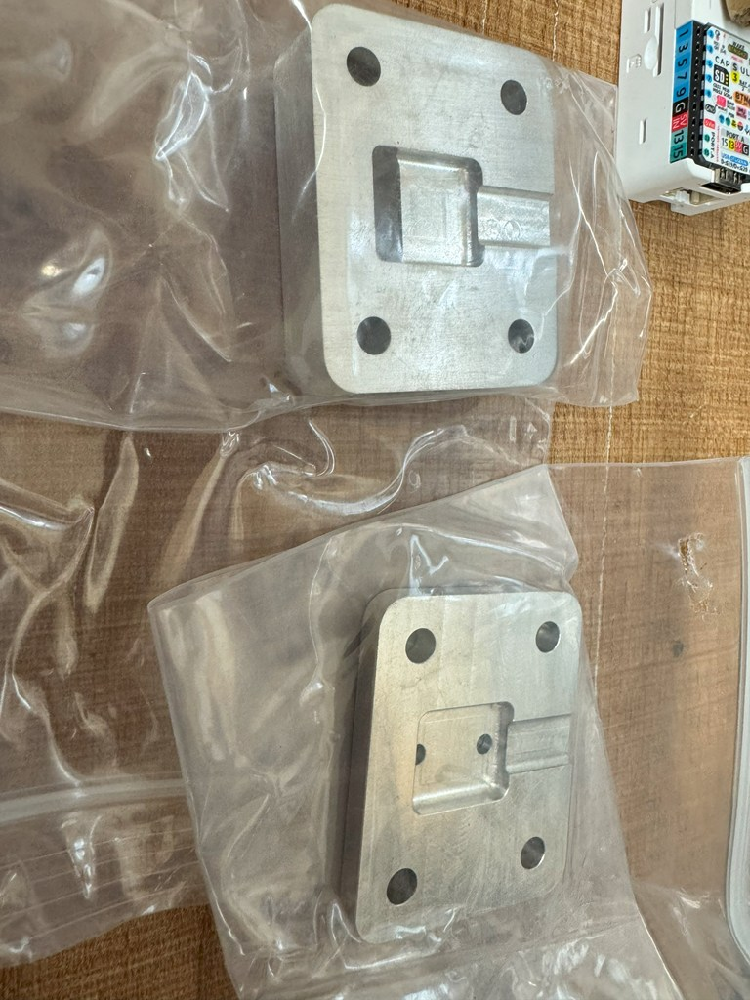

# JLCCNCでL字コネクタ用アルミ金型を発注する方法

このページでは、CNC加工サービス「[JLCCNC](https://jlccnc.com)」を使って、ホットボンド成形用のL字コネクタ金型を外注する方法を説明します。

## 📝 概要

- 加工内容：L字ホットボンド用金型（アルミ製・2ピース構造）
- 素材：アルミ（AL6061推奨）
- サイズ：約30mm × 30mm × 10mm 程度
- 価格：約 \$38（送料別）
- 発注日：6月10日
- 到着日：6月16日（6日で到着）

---

## 🔧 事前準備

### 必要なもの
- 加工用のデータ（.STEP)
- JLCCNCのアカウント（登録無料）
- クレジットカードまたはPayPal

---

## 🛒 発注手順

1. **[JLCCNC公式サイト](https://jlccnc.com) にアクセス**
2. トップページの「**CNC Machining**」の方の　**Quote Now** ボタンをクリック  
   
3. 加工データ（例：`l_shape_mold_v1.pdf`）をUpload 3D modelsへアップロード
4. アップロード後、「**材料（Material,Type of Aluminum）**」「**表面処理（Surface Finish）**」などを選択  
   - Material：Aluminum 6061
   - Surface :No (Finish：As machined) 今回、特に表面処理などは行いませんでした。
5. 加工数量（例：1個）を指定
6. 商品説明　(Product Desc) を選択
   -出荷の際の申告名称らしい。『Irregular shape Category -> Other -> "mold"』と記入しています。
7. 画面右側にTotal Priceが表示されているので確認する。Build timeを選ぶ。今回はStandardを選択。
8. 見積価格に問題なければそのまま「**Submit Order**」をクリックし、支払いを完了

---

## 📦 到着時の様子

しっかりとアルミで加工された金型が、緩衝材と一緒に丁寧に梱包されて届きます。

---

## 💡 注意点・コツ

- データはSTEPが最もスムーズです
- 小物金型の場合、送料込みでも\$50以内に収まることが多いです

---

## 🔗 参考資料

- 発注に使用したデータ：[ホットボンド金型 v7.step](ホットボンド金型 v7.step)
- JLCCNC公式サイト：[https://jlccnc.com](https://jlccnc.com)

---

## ❓ Q&A

**Q: 日本語のやり取りはできますか？**  
A: 基本は英語対応ですが、Google翻訳などを使えば問題なく進行可能です。

**Q: 他の金型も頼めますか？**  
A: 任意形状のCNC加工が可能です。L字以外の成形金型も発注できます。
